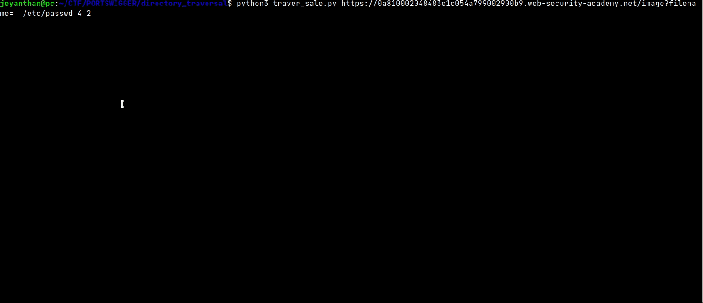

# Traver_sale

A simple tool made for testing  directory traversal.


## installation : 

```bash
pip install -r requirements.txt
```

## Usage:

```text
python3 traver_sale.py <URL> <FILE NAME> <LEVEL> <ENCODE> 

<URL>: url with the vulnerable parameter
<FILE NAME>: file to read
<LEVEL>: number of traversal sequence ex: 3 => ../../../
<ENCODE>: level of url encoding to test

ex:
 python3 traver_sale.py https://link/?filename=   /etc/passwd 5 5


```
